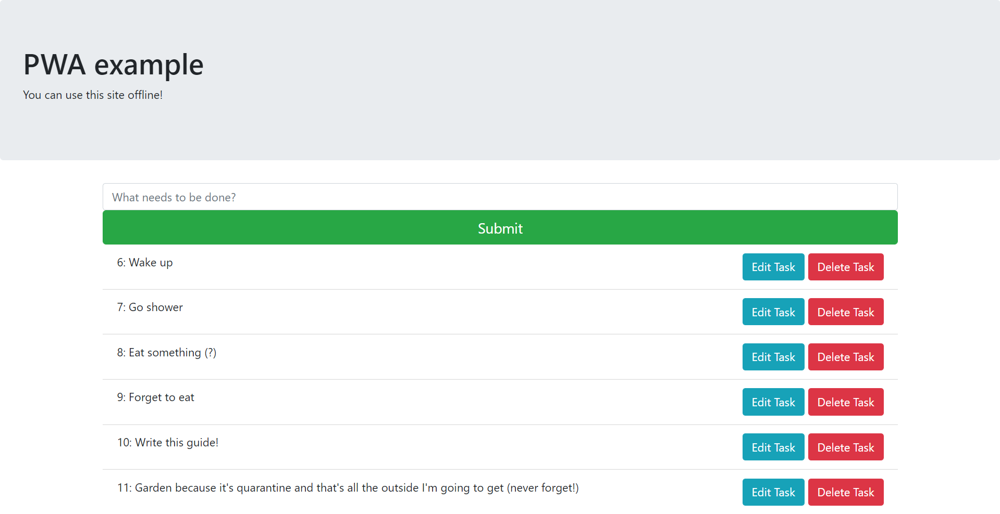

# Quick start to IndexedDB (all CRUD operations) Except U right now it's broken

Screenshot of app located at bottom

The whole poing of using indexedDB is so that we have a tool in the browser that can keep track of data so that when we implement some feature for offline use, we won't have MongoDB to solely rely on (MongoDB or any other DB which is using a virtual instance in production will _not_ work offline so this is our backup)

I always start with something that makes sense, in this case we should check if the user has indexedDB available, if not we let them know that offline use will not work

```
if (!window.indexedDB) {
  alert("Your browser doesn't support a stable version of IndexedDB. Offline features will not be available.");
}
```
Now let's get into the more complex stuff, starting with making a connection to indexedDB. For now we can think of indexedDB as something like localstorage in context of PWA. We are using this so that we can enable offline features. Even if the user has no internet they will still have access to the browser's indexedDB (like localstorage). Unlike localstorage, indexedDB can store all types of different data types such as object and arrays whereas localstorage only accepted strings.

```
const request = window.indexedDB.open("toDoList", 1);
var db; //this is a variable we will use throughout the file so I've decalred this globally
```

Just like in jQuery, we want to add listeners to handle different types of events. Let's add in an onsuccess event handler so we can handle what happens when line 7 executes properly. 

```
request.onsuccess = function (event) {
  console.log("check out some data about our opened db: ", request.result);
  db = event.target.result; // result of opening the indexedDB instance "toDoList"
  getTasks() //this function retrieves data from indexedDB so that if there is anything in there we can have it for our list
};
```

Of course, if something went wrong we should handle it

```
request.onerror = function (event) {
  console.log("Uh oh something went wrong :( ", request.error);
};
```

Let's move on to a more complex event listener: onupgradeneeded. If you've worked in Ruby on Rails or Python and Django you might be familiar with a term called database migrations. If not that's okay! Basically we can compare this next event listener to a database migration since it basically is our listener which is going to execute whenever we need to make a change to our database. We must manually change the version number everytime we change code in here or indexedDB will freak out! Refer to line 7 (the second argument after the database name is the version number of our database instance) Sometimes I've found it helpful to just delete and clear the db if I get version number errors or if I see strange behavior in the db (In this case the version number gets set back to 1)

```
request.onupgradeneeded = function (event) {
  // create object store from db or event.target.result
  db = event.target.result;
  let store = db.createObjectStore("tasks", { keyPath: "id", autoIncrement: true });
  store.createIndex("name", "name", {unique: false});
};
```

Function for retrieving the data (here is the R part of 'CRUD'!)
```
function getTasks(){
  var transaction = db.transaction("tasks", "readwrite");
  var tasksStore = transaction.objectStore("tasks");
  var retrievedb = tasksStore.getAll()
  retrievedb.onsuccess = function(){
    console.log(retrievedb.result)
    $(".list-group").empty()

    retrievedb.result.map(function(item){
      console.log(item)
      $(".list-group").append("<li class='list-group-item'>" + item.id + ": " + item.name + "<button style='float: right' type='button' idNo="+ item.id + " class='btn btn-danger deleteBtn'>Delete Task</button>")
    })
    

  }
}
```

Click listener for the submit button to create a new task (C of 'CRUD')
```
$("#newTask").click(function(){
  // console.log($("#taskName").val())
  var task = $("#taskName").val().trim()

  //give ourselves permission to read and write to the db
  var transaction = db.transaction("tasks", "readwrite");

  // open up a transaction for that particular store (What table/schema do we want to use?)
  var tasksStore = transaction.objectStore("tasks");
  let addReq =tasksStore.add({name: task});

  //when the task is added clear the form and retrieve from db (notice we can add an event listener to the above line!)
  addReq.onsuccess = function (e){
    $("#taskName").val("")
    getTasks()
  }
})
```

Delete button for created tasks (D of 'crud') Same process as adding something except here we are deleting!

Sidenote: using .on syntax since these buttons appear after page load

```
$(document).on("click",".deleteBtn",function(){
  var transaction = db.transaction("tasks", "readwrite");
  const store = transaction.objectStore('tasks')

  // I put the ID of the task in the delete button so here we retrieve it
  let taskId = $(this).attr("idNo")
  console.log(taskId)
  // here is the method for deletion
  var deleteReq = store.delete(Number(taskId))

  //after the above is successful we retrieve all the stuff in the db!
  deleteReq.onsuccess = function(){
    getTasks()
  }
})
```

It is also noteworthy that IndexedDB has some criticisms since it is using this outdated event listener technique to keep track of what's happening (onsuccess, onerror, onupgradeneeded, etc). IndexedDB was invented before promises and so that's why there's not any .then blocks anywhere even though now it makes a lot of sense to just use a .then. There is workaround though! 

[This is an NPM package which is basically just IndexedDB with promises!](https://www.npmjs.com/package/idb "IndexedDB but make it this decade")

Here is what the app looks like!
 
